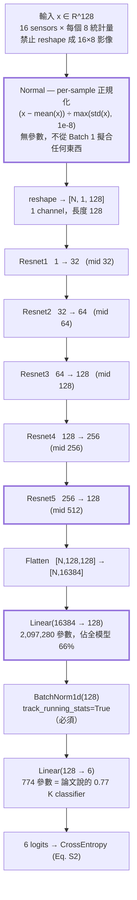
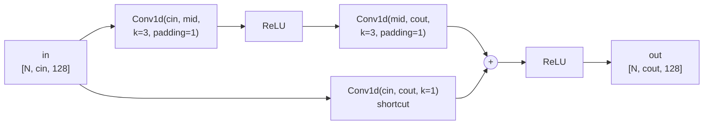
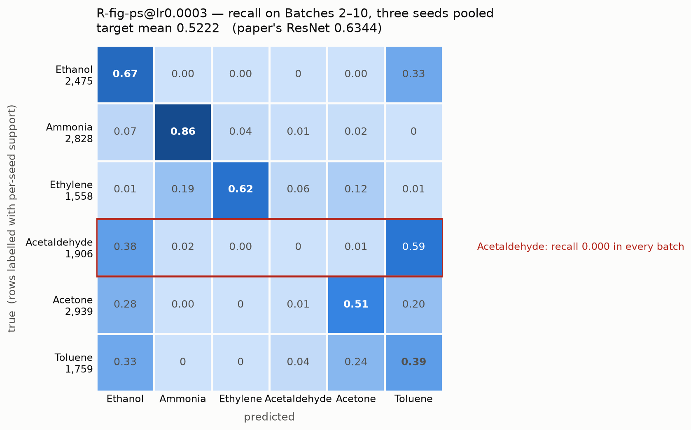

# CDCNN Baseline 最終設計

重建論文（*Sensors and Actuators: A. Physical* 372 (2024) 115314）Table 3 的
ResNet baseline。只有 `L_ce`，沒有資料擴充、特徵生成、對比損失。

分支 `exp/v7-redesign`，2026-09-23 定案。最佳設定 `R-fig-ps@lr0.0003`，
**target mean 0.5222 ± 0.0277**（論文 ResNet 0.6344）。

---

## 1. 架構



每個 `Resnet` block 的內部。**無正規化層、無 pooling，長度恆為 128**：



參數 **3,156,390** ＝ backbone 1,058,080 ＋ head 2,098,310。

### 關鍵函數與參數

| 項目 | 值 | 位置 |
|---|---|---|
| `Normal` | `(x − mean(x, axis=1)) / max(std(x, axis=1), 1e-8)` | `src/normalize.py` |
| Block | `Conv1d(k=3, padding=1) → ReLU → Conv1d(k=3, padding=1)` ＋ `Conv1d(k=1)`，相加後 ReLU | `src/model.py:ResidualBlock1D` |
| Channel（out） | `32, 64, 128, 256, 128` | `FIGURE_WIDTHS` |
| Channel（mid） | `32, 64, 128, 256, 512` | 同上 |
| Head | `Flatten → Linear(16384,128) → BatchNorm1d(128) → Linear(128,6)` | `src/model.py:FlattenHead` |
| 損失 | `L_ce`，Eq. (S2)：批內平均後跨批平均 | `src/loss.py` |
| 最佳化 | `SGD(lr=0.0003, momentum=0.9, weight_decay=1e-4)` | `configs/head_normalisation.json` |
| 排程 | `StepLR(step_size=25, gamma=0.5)` | 同上 |
| Epochs / batch | 100 / 64（445 筆 ＝ 6×64 ＋ 1×61） | 同上 |
| Seeds | 1042, 2024, 3407 | 同上 |

`L_ce` 的批內平均再跨批平均（Eq. S2）與全域平均在 445 筆配 batch 64 時差約 2e-3，
`src/loss.py:EpochLoss` 兩者都記錄。

---

## 2. 結果

| | target mean |
|---|---:|
| **本設計** | **0.5222** ± 0.0277 |
| 論文 ResNet | 0.6344 |
| 論文 CDWC | 0.6705 |
| 論文 CDCNN | 0.7230 |

Batch 1 準確率 0.9633。逐 batch 對照論文 ResNet：

| Batch | 本設計 | 論文 | 差 |
|---|---:|---:|---:|
| 2 | 0.827 | 0.769 | **+0.058** |
| 3 | 0.729 | 0.662 | **+0.067** |
| 4 | 0.673 | 0.642 | **+0.030** |
| 6 | 0.688 | 0.725 | −0.038 |
| 7 | 0.466 | 0.502 | −0.036 |
| 10 | 0.390 | 0.430 | −0.040 |
| 5 | 0.501 | 0.716 | **−0.215** |
| 9 | 0.255 | 0.604 | **−0.349** |
| 8 | 0.171 | 0.660 | **−0.489** |

**九個 batch 有六個追平或超過論文的 ResNet。** 整個 0.112 的缺口全部來自
B5、B8、B9，而這三個有共同成因（第 5 節）。

### 混淆矩陣



`R-fig-ps@lr0.0003` 在 v7.1、v7.2 兩次獨立 run 中都回傳 0.5222，小數點後四位相同。

---

## 3. 失敗的提案

所有訓練過的設定，依 target mean 排序。全部 `L_ce` only、100 epochs、
SGD(momentum 0.9, wd 1e-4)、StepLR(25, 0.5)、batch 64、三個 seed。

| 設定 | Channel | Head | 輸入 `Normal` | Head 正規化 | lr | target mean |
|---|---|---|---|---|---:|---:|
| **`R-fig-ps@lr0.0003`** | **Fig. 2** | **flatten** | **per-sample** | **BatchNorm** | **0.0003** | **0.5222** |
| `R-txt-ps@lr0.0003` | 封頂 128 | flatten | per-sample | BatchNorm | 0.0003 | 0.4928 |
| `R-fig-ps@lr0.001` | Fig. 2 | flatten | per-sample | BatchNorm | 0.001 | 0.4770 |
| `R-fig-ln@lr0.0003` | Fig. 2 | flatten | StandardScaler | LayerNorm | 0.0003 | 0.4760 |
| `R-fig-ps@lr0.0001` | Fig. 2 | flatten | per-sample | BatchNorm | 0.0001 | 0.4724 |
| `R-txt-ps` | 封頂 128 | flatten | per-sample | BatchNorm | 0.001 | 0.4673 |
| `R-txt-ps@lr0.0001` | 封頂 128 | flatten | per-sample | BatchNorm | 0.0001 | 0.4621 |
| `R-fig-ps-ln@lr0.0003` | Fig. 2 | flatten | per-sample | LayerNorm | 0.0003 | 0.4468 |
| `R-fig@lr0.0003` | Fig. 2 | flatten | StandardScaler | BatchNorm | 0.0003 | 0.4105 |
| `R-lite-ps` | 封頂 128 | **GAP** | per-sample | BatchNorm | 0.001 | 0.3931 |
| `R-txt` | 封頂 128 | flatten | StandardScaler | BatchNorm | 0.001 | 0.3777 |
| `R-lite` | 封頂 128 | **GAP** | StandardScaler | BatchNorm | 0.001 | 0.2958 |

「封頂 128」＝ channel `32, 64, 128, 128, 128`，內文 Section 5.2 說
「channels increase from 1 to 128 step by step」的讀法；「Fig. 2」＝
`32, 64, 128, 256, 128`（mid 到 512），圖上印的讀法。兩者矛盾，資料支持圖。

---

## 4. 每個選擇的證據

三輪因子實驗，粗體為統計上可分辨（差距 > 2×SE）：

| 改動 | 效應 | 可分辨 | 來源 |
|---|---:|---|---|
| per-sample 輸入取代 StandardScaler（BatchNorm head 下） | **+0.112** | 是 | v7.2 |
| flatten head 取代 GAP | **+0.078** | 是 | v7.0 |
| head 用 BatchNorm 而非 LayerNorm（per-sample 下） | **+0.075** | 是 | v7.2 |
| LayerNorm head 取代 BatchNorm（StandardScaler 下） | **+0.065** | 是 | v7.2 |
| lr 0.001 → 0.0003（Fig. 2 backbone） | +0.045 | 否 | v7.1 |
| Fig. 2 channel 取代封頂 128（lr 0.0003） | +0.029 | 否 | v7.1 |
| lr 0.001 → 0.0001 | −0.005 | 否 | v7.1 |

### 4.1 GAP pooling 有害（v7.0）

2×2 因子實驗（head × 輸入正規化），封頂 128 backbone，lr 0.001，四格 12 個 run。
GAP 在另一個因子的兩個水準上都變差（−0.082 / −0.074），2×SE 門檻 0.0719。

論文 Section 5.2「this network doesn't apply the pooling layer」是有分量的。原因：
128 維裡每組 sensor 的第 1 個是量級 10⁴ 的穩態電阻、其餘 6 個是量級 10⁰ 的瞬態特徵，
平均會讓大的淹掉小的，抹掉氣體辨識所依賴的跨 sensor 比例關係。

**記憶化不是缺口的成因。** flatten head 把 Batch 1 背到 1.0000（三個 seed 都是），
GAP 只到 0.955，但前者的 target 反而高 0.078。

### 4.2 Channel 與學習率（v7.1）

2×3 因子實驗（channel × lr），flatten head + per-sample，六格 18 個 run。

| | lr 0.001 | lr 0.0003 | lr 0.0001 |
|---|---:|---:|---:|
| 封頂 128 | 0.4673 | 0.4928 | 0.4621 |
| Fig. 2 | 0.4770 | **0.5222** | 0.4724 |

兩個因子的方向都符合預期——Fig. 2 通道在三個 lr 都較好，lr 0.0003 在兩個 backbone
上都勝過 0.001 和 0.0001（非單調，有內部最佳值）——但最大的效應 +0.0452 落在
2×SE 門檻 0.0469 之下，**都不能宣稱**。要分辨這種大小的效應每格需要約 8 個 seed。

### 4.3 兩個正規化是替代品（v7.2）

2×2 因子實驗（輸入 `Normal` × head 正規化），Fig. 2 通道 + lr 0.0003，
四格參數量完全相同（3,156,390），12 個 run。

| | 輸入 StandardScaler | 輸入 per-sample |
|---|---:|---:|
| head BatchNorm | 0.4105 | **0.5222** |
| head LayerNorm | 0.4760 | 0.4468 |

pooled SD 0.0165，門檻 0.0269，**四個比較全部可分辨**，交互作用 **−0.1408**。

**各自單獨用都有大幅幫助，兩個一起用比只用一個還差。** 它們做的是同一件事——
「用樣本自己的統計量取代存下來的 Batch 1 統計量」——一個在輸入端、一個在 head，
做兩次等於把同樣的資訊除掉兩次。

這也重現了舊專案的 +0.085：在它原本測量的條件下（StandardScaler 輸入），
本專案量到 +0.0654。

**禁止事項**：`BatchNorm1d(track_running_stats=False)` 會在推論時用該批次自己的
統計量正規化 target，屬於對 target 的測試期調適，且預測會依賴同批次有哪些樣本。
`tests/test_baseline.py` 斷言所有變體的每一個 `_BatchNorm` 都保持
`track_running_stats=True` 且有 `running_mean`。

---

## 5. 兩個結構性限制

> 氣體名稱依 `docs/label-mapping.md` 的對應（`1=Ethanol, 2=Ammonia, 3=Ethylene,
> 4=Acetaldehyde, 5=Acetone, 6=Toluene`）。2026-09-23 更正，所有數值不變。

### 5.1 Acetaldehyde 完全無法遷移

| 設定 | 輸入 `Normal` | Batch 1 Acetaldehyde | target Acetaldehyde |
|---|---|---:|---:|
| `R-txt` | StandardScaler | **1.000** | **0.001** |
| `R-txt-ps@lr0.001` | per-sample | 0.900 | 0.001 |
| `R-txt-ps@lr0.0003` | per-sample | 0.633 | 0.000 |
| `R-txt-ps@lr0.0001` | per-sample | 0.078 | 0.000 |
| `R-fig-ps@lr0.001` | per-sample | 0.900 | 0.027 |
| `R-lite-ps` | per-sample | 0.000 | 0.000 |

兩件事同時發生：

**在 source domain 上，per-sample 正規化專門傷害 Acetaldehyde。** 用 Batch-1
擬合的 `StandardScaler` 時 `R-txt` 把它學到滿分 1.000；換成 per-sample 掉到
0.90，隨 lr 下降再掉到 0.63、0.08，而**其他五個類別在所有設定下都 ≥ 0.94**。
它是 Batch 1 最小的類別（30/445），辨識它靠的主要是整體強度——而那正是把每一列
除以自己標準差所移除的東西。

**在 target domain 上，不管怎樣都會失去。** `R-txt` 在 Batch 1 上帶著 1.000 的
Acetaldehyde，到 Batches 2–10 只剩 0.001。本專案訓練過的所有設定都不超過 0.027。
**類別加權無法解決**：這個類別在能學的地方已經學滿了。

更根本的原因是資料幾何，不是模型。**每一個 target batch 的 Acetaldehyde 重心，
都不在自己原本的位置——九個 batch，九次，其中八次落在離 Batch 1 的 Ethanol
重心最近的地方。** 在原始特徵、StandardScaler、per-sample、兩者複合、signed-log
五種輸入空間下都是 9/9。它的漂移距離是自身類內半徑的 **18.3 倍**，方向卻是六個
類別裡最一致的（36 組 batch 配對的 cosine 最低 0.761）。

這解釋了為什麼架構、正規化、head、最佳化器完全不同的 v6.3 與 v7 會死在同一個
類別上：**Batch 1 訓練出的邊界把那塊區域判給 Ethanol 是正確的，是 target 讓它
失效的。** 完整量測見 `docs/why-acetaldehyde.md`。

### 5.2 論文死在同一個類別上

論文自己的 Fig. S3 混淆矩陣對照本設計：

| 類別 | 論文 CDCNN | 論文 CDWC | 本設計 |
|---|---:|---:|---:|
| Ethanol | 0.97 | 0.88 | 0.67 |
| Ethylene | 0.95 | 0.87 | 0.62 |
| Ammonia | 0.91 | 0.87 | 0.86 |
| **Acetaldehyde** | **0.00** | **0.00** | **0.00** |
| Acetone | 0.94 | 0.85 | 0.51 |
| Toluene | 0.92 | 0.27 | 0.39 |

**三個模型都在 Acetaldehyde 上得到 0.00，而且都主要把它送進 Ethanol**：
論文 CDCNN 100%、CDWC 92%、本設計 37.7%（另有 59.3% 進 Toluene）。
這個混淆**不是化學相似性造成的**。Batch 1 上模型把六個類別全部分對，
Acetaldehyde 的 source recall 是 1.000；而且以重心距離除以類內半徑衡量，
Ethanol↔Acetaldehyde 只排第四近（4.42），最近的一對是 Acetaldehyde↔Acetone
（1.02，幾乎重疊）卻完全沒有混淆問題。成因是 5.1 節的 drift：乙醛的雲團移動
18 倍自身半徑，**落到 Batch 1 時期乙醇所在的位置**。為何方向剛好指向乙醇，
這份資料無法回答。

Acetaldehyde 佔 target 的 14%（1,906/13,465），所以它歸零把論文的 pooled 準確率
壓到約 0.80；target mean 是逐 batch 的未加權平均、對難的後段 batch 權重更高，
因此落在它宣稱的 0.7230。

**論文在其餘五個類別上都領先**（最大差距 Toluene 0.92 vs 0.39、Acetone 0.94 vs
0.51），所以剩餘的 0.112 差距不在死類別，而在那五個。

### 5.3 Acetone 在 B6 之後崩進 Toluene

逐 batch 的 Acetone recall：B2–B6 都在 0.836–1.000，**B7 掉到 0.175，
B8、B9、B10 全是 0.000**。B8 裡 143 個 Acetone 有 139 個被判成 Toluene，
而 Acetone 佔該 batch 的一半——光這一個混淆就把 B8 的上限壓在 0.51。

### 5.4 上限

把死類別修好後重算各 batch 準確率（其餘不變）：

| | target mean |
|---|---:|
| 實測 | 0.5222 |
| 只修好 Acetaldehyde | **0.6683** |
| Acetaldehyde ＋ Acetone 都修好 | **0.7854** |
| 論文 ResNet | 0.6344 |
| 論文 CDCNN | 0.7230 |

**光是 Acetaldehyde 就值 +0.146**，足以讓這個沒有任何 CDCNN 元件的裸 baseline
超過論文的 ResNet。但要注意**論文自己也沒救回這個類別**——它的 0.7230 就是在
Acetaldehyde 為零的情況下達成的。對照之下，第 4 節量過的所有架構與最佳化選擇
加起來的跨度約 0.23，最大的單一槓桿值 0.112。

### 5.5 Epoch 數無法選擇

兩次 5-fold 交叉驗證（共 120 folds，全程只碰 Batch 1）證明 held-out 準確率與
held-out 損失**都無法**定位 target 峰值：CV 準確率的峰值落在 epoch 60/66/93/99、
CV 損失的最小值落在 87/89/98/100，而 target 峰值在 7/40/70。

最清楚的一格 `R-fig@lr0.0003`，target 在 epoch 7 達峰 0.5605、到 epoch 100
掉到 0.3968（−0.164）。在**完全相同的窗口內**：

```
epoch 7 → 100    held-out 準確率  0.9250 → 0.9754   (+0.050)  改善
                 held-out 損失    1.4284 → 0.1309   (−1.298)  改善
                 TARGET           0.5605 → 0.3968   (−0.164)  崩潰
```

兩個 source-only 訊號與 target **反向相關**，不是訊號太弱。原因是結構性的：
交叉驗證量的是「對同一個 domain 的泛化」（不同樣本、相同感測器、相同兩個月），
要偵測的卻是「對漂移後 domain 的泛化」（三年、16 個老化的感測器）。把 Batch 1
擬合得更好會改善前者並摧毀後者，**任何只從 Batch 1 計算的量都看不到這個取捨**。

因此 epoch 數只能事先以慣例訂死（論文訂 100，本設計沿用）。代價可量化：
若能停在各自峰值，最佳格值 +0.057、`R-fig` 值 +0.164——但這是 target-informed
的上界，沒有合法規則能達到。完整證據見 `docs/early-stopping.md`。

---

## 6. 協定

Batch 1（445 筆）是唯一的來源。所有訓練、正規化擬合、調參、交叉驗證只用它。
Batches 2–10 在全部 checkpoint 寫入並雜湊之前不得開啟；`load_target()` 沒有
`TargetAccessLog` 就拋錯，每次 run 都寫 leakage audit。

指標是 **target mean**：九個 batch 各自準確率的**未加權平均**，與論文 Table 3
同一個統計量。

Label 對應為 `1=Ethanol, 2=Ammonia, 3=Ethylene, 4=Acetaldehyde, 5=Acetone,
6=Toluene`，取自資料集自身的說明文件（該文件寫的是 `2=Ethylene, 3=Ammonia`，
2 與 3 依 Batch 1 的主成分結構對照論文 Fig. 4(a) 後對調）。**論文 Table 2 的
每批計數表在此對應下只有 Toluene 一欄吻合，這個衝突被記錄而非消解**——說明文件
是對「手上這些檔案」更直接的陳述。判準、證據與被否決的來源見
`docs/label-mapping.md`；`tests/test_baseline.py` 鎖住的是每個 label 的**計數**
（檔案的事實）與所採用的對應，而不是計數與名稱的配對。

改動對應**不改變任何數值**：訓練與評估路徑只用整數標籤。

---

## 7. 重現

```bash
docker build -t cdcnn:cu121 -f docker/Dockerfile .
DOCKER="docker run --rm --gpus all --user $(id -u):$(id -g) -e HOME=/tmp \
  -v $PWD:/workspace -w /workspace cdcnn:cu121"

$DOCKER python -m unittest discover -s tests
$DOCKER python scripts/run_baseline.py gpu-smoke --config configs/head_normalisation.json
$DOCKER python scripts/run_baseline.py launch --config configs/head_normalisation.json \
  --max-workers 1 --gpu-smoke-run runs/<passing_gpu_smoke>
```

`--user` 不可省略，否則容器會以 root 寫出 run 目錄。

環境必須是 torch 2.5.1+cu121。torch 2.8.0+cu126 對這台機器的 CUDA 12.2 驅動
（535.309.01）會觸發 Xid 31 MMU fault 並汙染整台機器的 CUDA 狀態。

---

## 8. 尚未解決

1. **Acetone 在 B6 之後崩進 Toluene**，單獨值 0.117，從未被解釋。
2. **論文為何在其餘五個類別上領先**——第 4 節掃過 head 形式、輸入正規化、
   head 正規化、channel 寬度、學習率，加起來只有 0.23 的跨度，不足以解釋。
   注意論文與本設計在 Acetaldehyde 上同樣是 0.00，所以差距完全在另外五個類別。
3. **資料擴充的幅度**（`docs/why-acetaldehyde.md`）。Acetaldehyde 的漂移方向有
   **96.9%** 落在 Batch 1 自身類內變異的前五個主軸內——也就是說沿著 Batch 1 自己
   的主方向擴充，原理上到得了 target Acetaldehyde 所在的位置。需要的位移是 18 個
   類內半徑。
   舊專案掃過的擴充雜訊是 0 / 0.05 / 0.2 / 0.5，每個都測到 −0.013 到 −0.009，
   但那些尺度**產生不了這個量級的位移**，所以它回答的是另一個問題。
   這是論文擴充模組第一個不依賴論文說法、而是由本專案資料推導出來的存在理由。
4. **`StandardScaler` 後再做 per-sample**：在重心錯位的檢查上把 Ethanol 和
   Ethylene 都降到 0/9（現用的 per-sample 是 2/9 和 5/9），從未訓練過。
