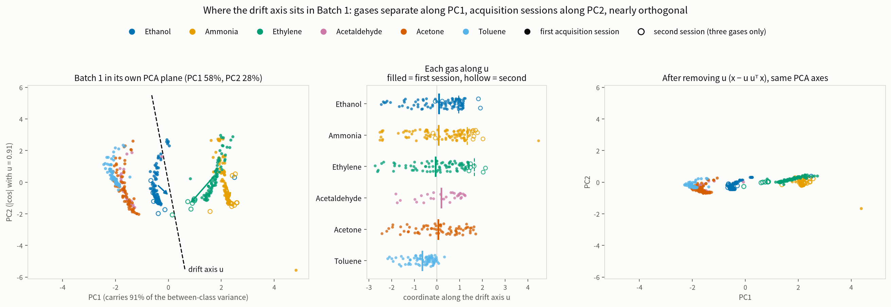

# v12 step 0: Batch 1 stays separable with the drift axis removed

Measured 2026-10-05 on Batch 1 alone. No target file was opened, no checkpoint
was used, no GPU time was spent. Script: `scripts/measure_projection_separability.py`;
numbers: `reports/projection_separability.json`; figure:
`scripts/make_batch1_drift_axis_figure.py`.

This is the gate `proposal-v12.md` declares before any training: if removing
the drift subspace destroys the class structure of Batch 1, the rest of v12 is
not worth running.

## The candidate subspaces

All three are built from the same raw material. Three of the six gases were
acquired twice in Batch 1 (Ethanol, Ammonia, Ethylene; `src/augment.py:SOURCE_BLOCKS`).
For each, the second-session centroid minus the first-session centroid is one
128-dimensional offset vector. The candidates differ only in how the three
vectors are used:

| candidate | construction | k | status |
|---|---|---:|---|
| `eth` | Ethanol's offset alone | 1 | target-informed: that Ethanol's offset aligns best with the real drift was learned against target data |
| `offset-axis` (called `pc1` in the JSON) | the three offsets normalised, stacked 3 x 128, uncentred SVD, first right singular vector | 1 | source-only: the single line the three offsets share, no gas chosen, sign-indifferent |
| `sub3` | the span of all three offsets, QR basis | 3 | source-only: no choice at all |

The projection is `x' = x - U U^T x` applied in the signed-log -> per-sample
space, the same space the network reads.

## Where the axis sits

Left: Batch 1 in its own PCA plane. The gases separate along PC1, which carries
91 % of the between-class variance. The arrows join each gas's first-session
centroid to its second-session centroid; all three point the same way, nearly
perpendicular to PC1. The dashed line is the common offset axis `u`.

Middle: each gas's coordinate along `u`. The second sessions (hollow) sit about
one unit to the right of the first sessions (filled) for all three gases, and
the six gases are centred on the same place, so `u` carries time and almost no
gas identity.

Right: the same points after `x - u u^T x`, in the same PCA basis. Each gas
collapses to a line; second-session points land on first-session points; the
positions along PC1 are unchanged.

The relation to Batch 1's ordinary PCA, measured:

| Batch 1 PCA axis | total variance | between-class variance | \|cos\| with `u` |
|---|---:|---:|---:|
| PC1 | 58.3 % | 91 % | 0.10 |
| PC2 | 27.6 % | 3 % | **0.91** |
| PC3 | 6.1 % | 0.5 % | 0.09 |

`u` is not Batch 1's first principal component. PC1 is the gas axis; `u` is
0.91 aligned with PC2. The three individual offsets align with `u` at 0.90,
0.98 and 0.81, so the three gases' session displacements do share a line.

**One thing the figure shows that the numbers did not.** Within each gas the
points form a long streak, and the streak runs roughly along `u` too. That is
within-class variation, most likely concentration, and it is nearly parallel to
the session offset. Removing `u` therefore removes most of the within-class
spread together with the session offset. For classification that is welcome,
but `u` mixes "time" with "concentration" and the projection does not tell
them apart.

## The gate: five-fold cross-validation on Batch 1

Folds are the fixed stratified folds of `src/cv.py` (seed 20260923). The two
classifiers are stand-ins for the network, which needs the normaliser
implemented first; the network's own CV is the formal gate in step 1.

| 5-fold CV on Batch 1 | none | `eth` k=1 | `offset-axis` k=1 | `sub3` k=3 |
|---|---:|---:|---:|---:|
| nearest centroid | 0.850 | 0.859 | **0.928** | 0.901 |
| logistic regression | 0.962 | 0.953 | 0.955 | 0.951 |

**All three candidates pass.** Logistic regression drops by at most 0.011
against the declared ceiling of 0.02.

Nearest-centroid accuracy rises rather than falls, from 0.850 to 0.928 under
`offset-axis`. Batch 1's within-class radius already contains its own
two-session offset; removing that axis tightens every cloud and the centroids
separate better. This is a source-internal check of the idea that needs no
target data.

## What the removed subspace carried

| | `eth` | `offset-axis` | `sub3` |
|---|---:|---:|---:|
| share of Batch 1's total variance removed | 0.285 | 0.236 | **0.739** |
| share of between-class variance removed | 0.213 | **0.028** | **0.764** |

`offset-axis` has the profile a drift axis should have: it carries 24 % of the
total variance and only 3 % of the between-class variance, so it is almost
entirely within-class (session-to-session) variation.

`sub3` removes 76 % of the between-class variance. Batch 1 is low-dimensional
in the per-sample space (the first two principal components carry 86 %), so
three offset vectors span most of its structure. Its CV accuracy is still 0.951,
meaning the remaining 26 % of the variance still separates the six gases, but
the cost is real.

## The fifteen class-pair separations

Centroid distance over the mean of the two within-class radii, before and after
projection, sorted by the unprojected value:

| pair | none | `eth` | `offset-axis` | `sub3` |
|---|---:|---:|---:|---:|
| Acetaldehyde-Acetone | 0.40 | 0.53 | 0.62 | 0.64 |
| Ammonia-Ethylene | 1.07 | 1.40 | 1.97 | 2.48 |
| Ethanol-Acetaldehyde | 1.12 | 1.42 | **1.85** | 1.01 |
| Acetone-Toluene | 1.21 | 1.29 | 1.49 | 1.56 |
| Ethanol-Acetone | 1.28 | 1.67 | 2.32 | 1.49 |
| Acetaldehyde-Toluene | 1.29 | 1.15 | 1.29 | 1.29 |
| Ethanol-Ethylene | 1.99 | 2.39 | 3.55 | 2.15 |
| Ethanol-Toluene | 2.15 | 2.14 | 3.16 | 2.30 |
| Ethanol-Ammonia | 2.25 | 2.92 | 4.26 | 2.18 |
| Ethylene-Acetaldehyde | 2.92 | 3.45 | 4.76 | 2.43 |
| Ethylene-Acetone | 3.03 | 3.73 | 5.41 | 2.97 |
| Ammonia-Acetaldehyde | 3.19 | 4.09 | 5.49 | 2.59 |
| Ammonia-Acetone | 3.30 | 4.44 | 6.23 | 3.06 |
| Ethylene-Toluene | 4.00 | 4.18 | 6.32 | 3.75 |
| Ammonia-Toluene | 4.43 | 5.22 | 7.45 | 4.22 |

`offset-axis` widens all fifteen pairs. `sub3` narrows six of them, including
Ethanol-Acetaldehyde (1.12 to 1.01), the pair behind the dead class.
Acetaldehyde-Acetone is the closest pair under every version (0.40 to 0.64);
that overlap is native to Batch 1 and has nothing to do with drift.

## Consequence for the design

The proposal named `sub3` the headline cell because it involves no choice.
On Batch 1 evidence alone, `offset-axis` is better on every measure and `sub3`
removes too much class information. Choosing on Batch 1 is permitted under the
source-only protocol, so the recommendation is to make `offset-axis` the
headline, demote `sub3` to the second cell, and keep `eth` as the
target-informed comparison. The change is recorded here before any target file
is opened; the decision is the user's.

## Limits

- The two classifiers are linear. The network's cross-validation may differ;
  it is the formal gate once the normaliser exists.
- The separation statistic uses the mean distance to the centroid as the radius,
  which differs from the definition in `baseline.md` section 5.2. Only the
  relative changes are comparable.
- `offset-axis` is built from three offsets whose second sessions hold 6, 10
  and 7 rows.
- That any of these axes tracks the real three-year drift was established
  against target data in `docs/batch1-internal-drift.md` and
  `docs/drift-geometry.md`. The estimator is source-only; knowing that it works
  is not.
