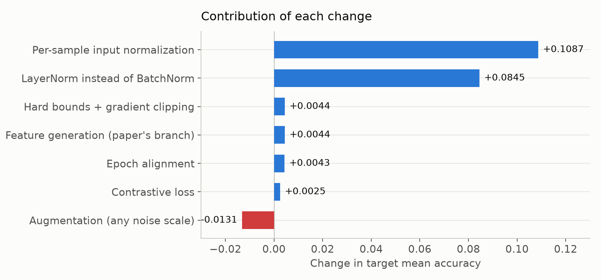
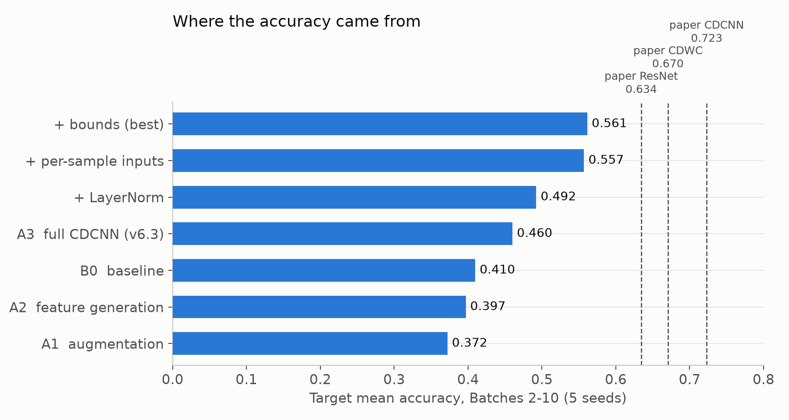
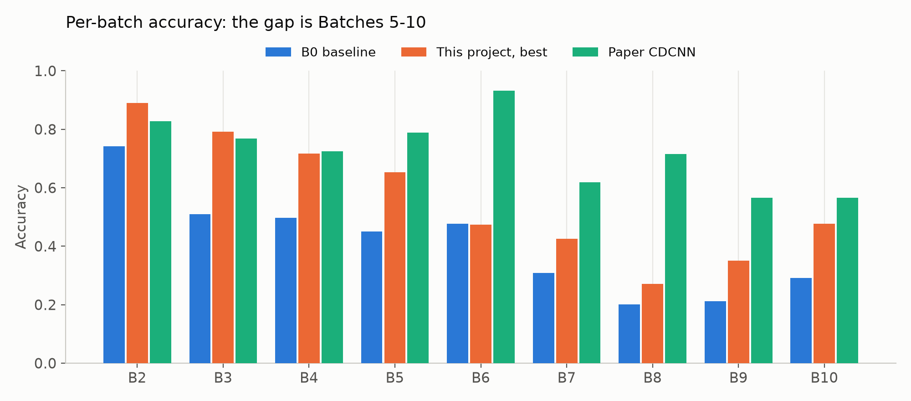
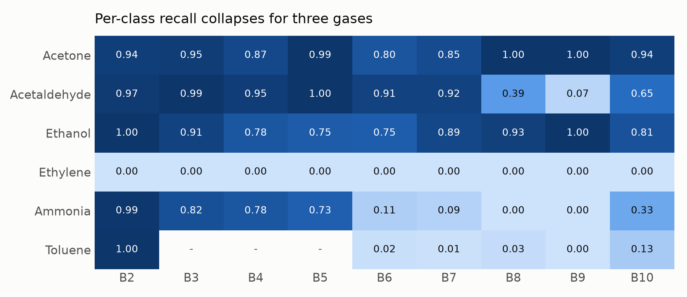
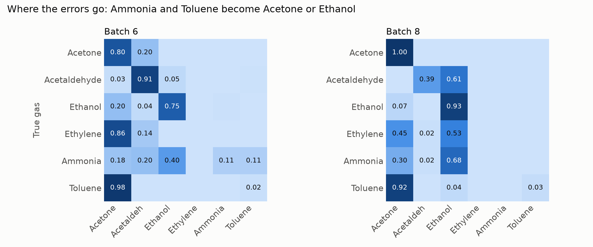
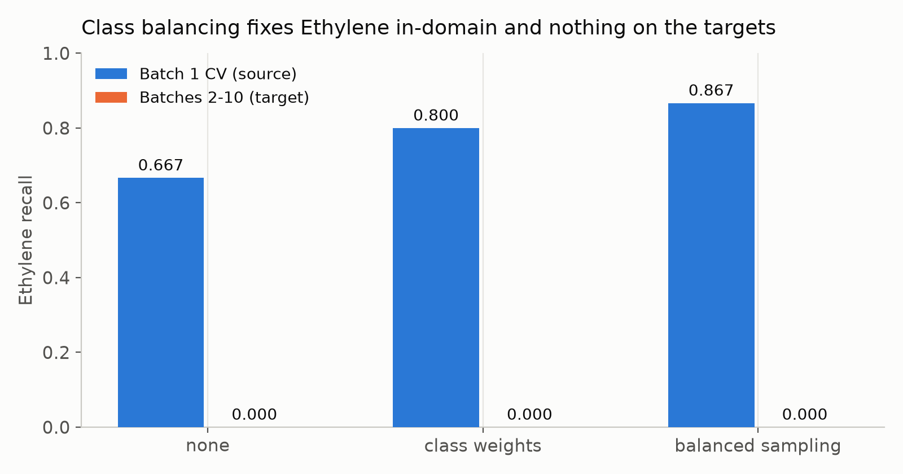
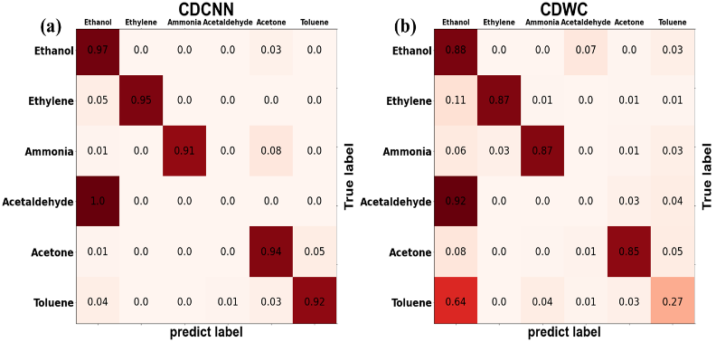

# CDCNN 復現實驗回顧

> 逐頁講稿，可直接複製。圖片在 `reports/figures/`，圖內文字為英文以確保各平台顯示一致。
> 所有數字皆出自 `runs/` 下通過 audit 的執行結果，2026-09-11 至 2026-09-22。

---

## 第 1 頁：一句話結論

**我們把模型從 0.460 做到 0.561，但進步全部來自正規化，CDCNN 的三個機制加起來約等於零。**

- 目標：在嚴格 source-only 協定下復現 CDCNN（Sensors and Actuators A 372, 2024, 115314）
- 論文宣稱 0.7230，我們目前 0.5613
- 十一輪實驗、約 200 個訓練檢查點，全部通過洩漏稽核

---

## 第 2 頁：實驗協定

**只用 Batch 1 訓練，凍結後才准看 Batch 2–10。**

- 訓練、正規化擬合、交叉驗證、超參數選擇：**全部只用 Batch 1**（445 筆）
- 所有檢查點凍結並雜湊後，目標批次才**各載入一次**做最終評估
- 五個固定種子（1042 / 2024 / 3407 / 42 / 123）、100 epochs、SGD、StepLR、batch 64
- 每次執行都寫入獨立目錄，附完整稽核紀錄；任一協定違規會讓執行失敗

> 指標說明：**target mean** = 九個目標批次準確率的未加權平均，與論文報告的統計量相同。

---

## 第 3 頁：正式的四階段結果

| Stage | Batch 1 CV | Target mean | SD | B2 | B3 | B4 | B5 | B6 | B7 | B8 | B9 | B10 | 論文 |
|---|---|---|---|---|---|---|---|---|---|---|---|---|---|
| **B0** 基線 | 0.9779 | 0.4097 | 0.0213 | 0.741 | 0.509 | 0.497 | 0.451 | 0.476 | 0.309 | 0.201 | 0.212 | 0.291 | 0.6344 |
| **A1** +輸入增強 | 0.9797 | 0.3721 | 0.0190 | 0.732 | 0.498 | 0.487 | 0.330 | 0.418 | 0.273 | 0.126 | 0.182 | 0.304 | — |
| **A2** +特徵生成 | 0.9824 | 0.3968 | 0.0121 | 0.767 | 0.509 | 0.494 | 0.359 | 0.415 | 0.285 | 0.171 | 0.261 | 0.309 | 0.6705 |
| **A3** +對比學習 | 0.9676 | 0.4600 | 0.0254 | 0.893 | 0.683 | 0.576 | 0.349 | 0.415 | 0.330 | 0.172 | 0.303 | 0.419 | 0.7230 |

- 四個 stage 的 Batch 1 CV 都在 0.97–0.98：**問題不在擬合，在泛化**
- A1、A2 比基線還差，順序沒有重現論文

---

## 第 4 頁：第一個發現 — A3 的增益不是對比學習

A3 比 A2 高 0.067，看起來像對比學習有效。但 v6.3 一次給了 A3 四樣東西。

| 拆解步驟 | 效果 | 種子 |
|---|---|---|
| **LayerNorm 取代 BatchNorm** | **+0.0845** | **5/5** |
| 硬性界限 + 梯度裁剪 | −0.0022 | 1/5 |
| 增強 + 特徵生成 | −0.0328 | 0/5 |
| **對比損失** | **+0.0029** | 4/5 |

- BatchNorm 把 Batch 1 的統計量套到漂移後的資料上；LayerNorm 逐樣本正規化
- 增益最大的批次正是漂移最嚴重的（B10 0.291→0.497）

---

## 第 5 頁：對照論文後的震撼

**論文的純 ResNet 基線（0.6344）贏過我們當時所有 stage（最高 0.4922）。**

- 差距在 CDCNN 三個元件「之外」——不是方法不夠，是上游有問題
- 讀完論文與補充資料後發現三個未聲明的差異：
  - 對比損失應接在 FC128 **之前**、沒有可學的 head
  - Eq. (16) 除以的是**變異數**而非標準差
  - Block 5 內層是 512 寬
- 論文本身還有自相矛盾處（統計量的維度、Table 2 有兩處錯誤）

---

## 第 6 頁：突破 — 逐樣本輸入正規化

| 改動 | 效果 | 種子 |
|---|---|---|
| **逐樣本輸入正規化** | **+0.1087** | **5/5** |
| LayerNorm | +0.0845 | 5/5 |
| 兩者合併 | **+0.1492** | 5/5 |
| signed-log 輸入 | +0.0013 | 2/5 |
| clip ±5 輸入 | −0.0073 | 0/5 |

- 在 Batch 1 的 scaler 下，Batch 2 有 |z| ≈ 1.5×10⁴ 的極端值
- 但**壓極端值沒用**（log、clip 都無效）——有效的是移除每個樣本自己的偏移與增益

---

## 第 7 頁：進步從哪裡來

- 0.460（原本的 CDCNN）→ 0.561（最佳）
- 全部來自正規化，不是來自 CDCNN 的任何一個元件

---

## 第 8 頁：輸入修好後，CDCNN 元件仍然無效

把同一組消融重跑在正規化後的輸入上：

| 步驟 | 未正規化輸入 | 逐樣本正規化輸入 |
|---|---|---|
| 界限 + 裁剪 | −0.0022 | +0.0044 |
| 增強 + 特徵生成 | −0.0328 | −0.0224 |
| 對比損失 | +0.0029 | −0.0049 |

- **輸入條件不是阻礙它們的原因**
- 同時：逐樣本正規化讓完整 CDCNN 也提升 +0.0738（A3 0.4602 → A3-PS 0.5340）

---

## 第 9 頁：增強為什麼扣分 — 不是雜訊，是排程

- 雜訊縮小 20 倍（1.0 → 0.05），target mean 只變 **+0.0026**
- 零雜訊的**純複製對照**仍然扣 −0.0114（真實增強是 −0.0131）

**真正原因**：增強 stage 有 890 筆而非 445 筆，在固定 100 epoch 下**多了一倍的優化步數**。

- 這意味著本專案（以及原本 v6.3）所有「A1 對 B0」的比較都被排程長度混淆
- 修正方式：每個 epoch 從增強池抽一份來源大小的子集 → 步數對齊

| 對齊後 | 效果 |
|---|---|
| 對齊本身 | +0.0043（補回約三分之一） |
| 對齊後的增強 vs 無增強 | −0.0089 |
| 種子標準差 | 0.0364 → **0.0136**（最穩定） |

---

## 第 10 頁：對比損失換到論文的位置 — 仍然是零

| 接法 | 效果 | 種子 |
|---|---|---|
| 我們的位置（FC128 後 + 可學 head） | +0.0025 | 3/5 |
| **論文的位置（FC128 前、無 head）** | **+0.0002** | 2/5 |

**五次獨立量測**（v6.3 / v6.5 / v6.6 / v6.9 / v6.10）全部落在 **−0.005 ～ +0.003**。

- 可能原因：Batch 1 的特徵本來就幾乎可分（CV 0.96–0.99），對比損失沒東西可拉近
- 而且這個項完全沒有看到目標域的資訊

---

## 第 11 頁：剩下的差距在哪（逐批次）

- **B2、B3、B4 我們已經追平或贏過論文**（B2 0.89 對 0.83）
- 差距集中在 **B5–B10**，尤其 B6（0.47 對 0.93）和 B8（0.27 對 0.72）

---

## 第 12 頁：剩下的差距在哪（逐類別）

- **Ethylene 九個批次全部 0.00**：9530 個樣本零命中，模型從不輸出這個標籤
- **Ammonia、Toluene 撐到 B5，之後崩潰**
- 這三類佔每個目標批次的 26–66%

> 注意：本專案原先文件的氣體標籤對應是錯的。用論文 Table 2 的各氣體筆數逐批次比對後，
> 正確為 **1=Acetone、2=Acetaldehyde、3=Ethanol、4=Ethylene、5=Ammonia、6=Toluene**（十批中八批完全吻合）。
> 準確率數字不受影響，因為訓練與評估只用整數標籤。

---

## 第 13 頁：錯誤流向哪裡

- B6：Toluene 98% 被判成 Acetone；Ammonia 40% 判成 Ethanol
- B8：Ammonia 68% 判成 Ethanol；Toluene 92% 判成 Acetone
- 預測分布嚴重偏向 Batch 1 的大類別（Acetone 被預測的頻率是實際的 2.4 倍）

---

## 第 14 頁：類別平衡 — 粗篩後否決

| | Batch 1 CV（Ethylene） | 目標（Ethylene） | Target mean |
|---|---|---|---|
| 無平衡 | 0.667 | 0.000 | 0.5521 |
| 類別加權 | 0.800 | 0.000 | 0.5485 |
| 平衡取樣 | **0.867** | **0.000** | 0.5454 |

- 平衡在**來源域完全有效**，但**一點也沒有傳遞到目標域**
- 結論：Ethylene 的問題是域偏移，不是類別不平衡
- 用一個種子粗篩（6 分鐘）就否決，省下五種子的 35 分鐘

**協定警訊**：Batch 1 CV 的排序與目標準確率**完全相反**——我們的協定用 CV 選模型，這次會選到最差的。

---

## 第 15 頁：論文自己也有一個死掉的類別

論文 Fig. S3 的 CDCNN 混淆矩陣有一列對角線是 0，質量全部落在隔壁欄。比對他們自己的逐批次數字，
最吻合的讀法是那個類別就是 **Ethylene**（推算 B6 = 0.93，論文報 0.9318）。

| 氣體 | 論文 CDCNN | 論文 CDWC | 我們 |
|---|---|---|---|
| **Ethylene** | **0.00** | **0.00** | **0.00** |
| Ammonia | 0.94 | 0.85 | B5 後崩潰 |
| Toluene | 0.92 | **0.27** | B5 後崩潰 |

- **我們的 Ethylene 零命中是重現了他們的結果，不是失敗**
- 真正的差距是 Ammonia 和 Toluene
- **他們對比學習的增益幾乎就是 Toluene 一類**（0.27 → 0.92）——那正是我們沒重現出來的東西

---

## 第 16 頁：結論

1. **正規化是這個資料集上唯一有效的槓桿**：逐樣本輸入 +0.109、LayerNorm +0.085
2. **CDCNN 的三個機制在嚴格 source-only 協定下約等於零**，五次獨立量測互相印證
3. **論文的宣稱有一部分無法重現**，且論文自身也有一個完全失效的類別
4. **我們發現並修正了一個協定層級的混淆**：固定 epoch 數讓增強組多了一倍訓練步數
5. 目前最佳 0.5613，距論文 0.7230 的差距集中在 Ammonia 與 Toluene 在 B5 之後的崩潰

---

## 第 17 頁：後續方向

| 優先 | 方向 | 理由 |
|---|---|---|
| 1 | **是什麼讓 Ammonia / Toluene 在 B5 後存活** | 論文的優勢與其對比消融的最大單類差異都在這裡 |
| 2 | 對比超參數（τ、λ、head 維度） | 論文從未給值，本專案也從未調過，可只用 Batch 1 CV 選 |
| 3 | 其餘數值忠實度項目 | σ′ 高斯取樣、Eq. (16) 的分母、block 5 的 512 寬 |
| 4 | epoch 協定的正式決定 | 對齊與不對齊各自固定不同的量，需要明確選一個 |

---

## 第 18 頁：附錄 — 結果可信度

- **每次改動前**都把所有既有 stage 用新舊程式碼各訓練一次，要求 **bit-identical**（最後一次檢查 26 個 stage）
- 設定檔以**凍結字面值**固定其階段清單，驗證器兩次擋下會改動已完成執行所依賴設定的編輯
- **同環境內完全可重現**；跨 torch 版本 CV 完全相同、target mean 可能差在小數第四位
- 每次執行自帶洩漏稽核；目標批次一律在凍結後才載入
- 訓練環境固定為容器（torch 2.5.1+cu121），起因是一次 Xid 31 GPU 故障

**過程中的四次失誤**（都已記錄）：session 中斷導致控制器被殺、報告產生器在 30 個檢查點評估完後 KeyError、
未加引號的 heredoc 弄壞一次文件編輯、以及上述 GPU 故障。

---

## 附：文件索引

| 主題 | 檔案 |
|---|---|
| 完整發展日誌 | `docs/development-journal.md` |
| 所有做法的 B2–B10 結果 | `docs/all-results.md` |
| 論文與實作的逐項比對 | `docs/paper-vs-implementation.md` |
| 逐類別失效分析 | `docs/per-class-failure.md` |
| 各次實驗細節 | `docs/a3-confound-ablation.md`、`input-normalization.md`、`normalized-input-ladder.md`、`paper-literal-ladder.md`、`augmentation-scale.md`、`duplication-control.md`、`epoch-alignment.md`、`contrastive-placement.md`、`class-balance.md` |
| 變更記錄 | `docs/change-log.md` |
